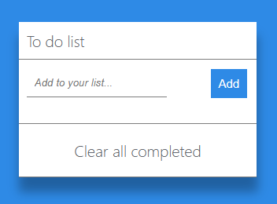

   

# To do list

# 📗 Table of Contents

- [📖 About the Project](#about-project)
  - [🛠 Built With](#built-with)
    - [Tech Stack](#tech-stack)
    - [Key Features](#key-features)
  - [🚀 Live Demo](#live-demo)
- [💻 Getting Started](#getting-started)
  - [Setup](#setup)
  - [Install](#install)
  - [Usage](#usage)
- [👷‍♂️ Author](#authors)
- [🔭 Future Features](#future-features)
- [🤝 Contributing](#contributing)
- [⭐️ Show your support](#support)
- [🙏 Acknowledgements](#acknowledgements)
- [📝 License](#license)

# 📖 To do list 

This is a project to create lists for a day. This was build using SPA (Single Page Application), JavaScript ES6, HTML5, CSS3, mobile-first approach. local storage API and DOM manipulation.

## 🛠 Built With 

### Tech Stack 

  
Languages and technologies
 
  <ul>
    <li><a href="#">JavaScript ES6</a></li>
  </ul>
  <ul>
    <li><a href="#">Webpack</a></li>
  </ul>
  <ul>
    <li><a href="#">HTML5</a></li>
  </ul>
  <ul>
    <li><a href="#">CSS3</a></li>
  </ul>
  <ul>
    <li><a href="#">Git and GitHub</a></li>
  </ul>

### Key Features 

- **[Easy navigation]**
- **[Personalized product]**
- **[Mobile first]**

(<a href="#readme-top">back to top</a>)

## 🚀 Live Demo 

- [Live Demo Link](https://j-c-s-v.github.io/webpack-to-do-list/)

(<a href="#readme-top">back to top</a>)

## 💻 Getting Started 

To get a local copy up and running, follow these steps.

### Setup

Clone this repository to your desired folder:

`git clone` https://github.com/J-C-S-V/webpack-to-do-list-

### Install

`npm install`

### Usage

`npm run build`

`npm run start`

## 👷‍♂️ Author 

👷‍♂️ **Juan Sanchez**

- GitHub: [Juan Sanchez](https://github.com/J-C-S-V)
- Twitter: [Juan Sanchez](https://twitter.com/juansan0)
- LinkedIn: [Juan Sanchez](https://www.linkedin.com/in/juan-carlos-sanchez-vargas-a308b014b/)

(<a href="#readme-top">back to top</a>)

## 🔭 Future Features 

- [ ] **[Payment]**
- [ ] **[Footer]**
- [ ] **[API integration]**

(<a href="#readme-top">back to top</a>)

## 🤝 Contributing 

Contributions, issues, and feature requests are welcome!

Feel free to check the [issues page](../../issues/).

(<a href="#readme-top">back to top</a>)

## ⭐️ Show your support 

If you get inspired by this project you can give me a star 🙌

(<a href="#readme-top">back to top</a>)

## 🙏 Acknowledgments 

I would like to thank Microverse

(<a href="#readme-top">back to top</a>)

## 📝 License 

This project is [MIT](https://github.com/J-C-S-V/Portfolio-setup-and-mobile-first/blob/main/license.md) licensed.

(<a href="#readme-top">back to top</a>)

